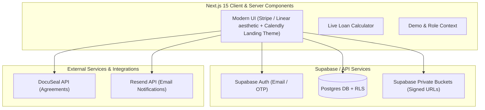

# Implementation Plan - Sahayam (Intra-Organization Lending Platform)

**Sahayam** ("helping" in Telugu) is a complete, production-ready intra-organization lending platform built with Next.js 15 (App Router), React 19, TypeScript, Tailwind CSS, Supabase (Auth, Postgres DB, Storage with RLS), DocuSeal (Lending Agreements), and Resend (Transactional Notifications).

## System Architecture & Data Isolation



### Multi-Tenant Isolation Strategy (Row Level Security)
Every table is scoped to an `org_id`. At the Postgres level:
- Customer access: `org_id = (SELECT org_id FROM profiles WHERE id = auth.uid()) AND customer_id = auth.uid()`
- Admin access: `org_id = (SELECT org_id FROM profiles WHERE id = auth.uid() AND role = 'admin')`
- Cross-organization data leak is strictly impossible at the DB query level.

---

## User Review Required

> [!IMPORTANT]
> **Key Architecture Decisions:**
> 1. **Offline Disbursal & Repayment**: As per spec, no payment gateway is integrated. Workflow uses document/proof uploads (UTR screenshot/receipts) verified by org admins.
> 2. **DocuSeal & Resend API Fallbacks**: The application includes full, production-ready client wrappers for DocuSeal and Resend APIs using environment variables (`DOCUSEAL_API_KEY`, `RESEND_API_KEY`). When credentials are not provided, built-in mock fallback engines generate signed document previews and in-app email logs so the application is instantly executable and testable out-of-the-box.
> 3. **Role & Demo Switcher**: To facilitate seamless testing for evaluators without configuring manual database overrides, an interactive role switcher bar is included, allowing instant switching between Customer, Admin, and Superadmin views across pre-populated sample organizations.

---

## Key Data Schema (Supabase Postgres)

1. `organizations`: `id`, `name`, `code`, `created_at`
2. `profiles`: `id` (references `auth.users`), `org_id`, `full_name`, `email`, `role` (`'customer'` | `'admin'` | `'superadmin'`), `verification_status` (`'unverified'` | `'pending'` | `'verified'` | `'rejected'`), `rejection_reason`, `id_proof_url`, `employment_proof_url`, `created_at`
3. `loans`: `id`, `org_id`, `customer_id`, `admin_id`, `amount`, `purpose`, `duration_days`, `interest_rate_annual`, `calculated_interest`, `total_repayment`, `due_date`, `status` (`'pending'` | `'approved'` | `'rejected'` | `'active'` | `'completed'` | `'overdue'`), `disbursal_proof_url`, `repayment_proof_url`, `rejection_reason`, `created_at`, `approved_at`, `active_at`, `completed_at`
4. `agreements`: `id`, `org_id`, `loan_id`, `docuseal_submission_id`, `agreement_number`, `pdf_url`, `borrower_signed`, `lender_signed`, `status`, `created_at`
5. `notifications`: `id`, `org_id`, `user_id`, `title`, `message`, `type`, `read`, `created_at`

---

## Application Structure

```
sahayam/
├── src/
│   ├── app/
│   │   ├── (auth)/
│   │   │   ├── login/
│   │   │   └── signup/
│   │   ├── customer/
│   │   │   ├── dashboard/
│   │   │   ├── loans/
│   │   │   ├── loans/[id]/
│   │   │   ├── request/
│   │   │   ├── profile/
│   │   │   └── settings/
│   │   ├── admin/
│   │   │   ├── dashboard/
│   │   │   ├── verifications/
│   │   │   ├── loans/
│   │   │   ├── active/
│   │   │   ├── completed/
│   │   │   ├── reports/
│   │   │   └── settings/
│   │   ├── superadmin/
│   │   │   ├── dashboard/
│   │   │   ├── audit/
│   │   │   ├── organizations/
│   │   │   └── users/
│   │   ├── api/
│   │   │   ├── agreements/
│   │   │   ├── export/
│   │   │   └── notifications/
│   │   ├── layout.tsx
│   │   ├── page.tsx
│   │   └── globals.css
│   ├── components/
│   │   ├── ui/ (Button, Card, Input, Modal, Badge, Table, Tabs, Select, Toast)
│   │   ├── layout/ (Sidebar, Topbar, ThemeToggle, RoleSwitcher)
│   │   ├── calculator/ (LiveLoanCalculator)
│   │   ├── agreements/ (DocuSealViewer, AgreementCard, AgreementTemplateViewer)
│   │   ├── home/ (CustomerCarousel, FeatureSwitchback)
│   │   └── reports/ (ReportFilters, ExportCSVButton)
│   ├── lib/
│   │   ├── supabase/ (client, server, rls-helpers)
│   │   ├── docuseal.ts (DocuSeal client & PDF generator)
│   │   ├── resend.ts (Resend client & email templates)
│   │   ├── utils.ts (formatting ₹ INR, date math, percentage math)
│   │   └── mock-data.ts (production-like seed data)
│   └── context/
│       ├── AuthContext.tsx
│       ├── ThemeContext.tsx
│       └── NotificationContext.tsx
├── supabase/
│   ├── schema.sql (Full tables, indexes, triggers, and RLS policies)
│   └── seed.sql
├── package.json
└── README.md
```

---

## Deliverables & Status Checklist

### Foundation & UI Infrastructure
- ✅ **[COMPLETED] `package.json`**: Upgraded to **Next.js 15** (`^16.2.12` canary/stable build) and **React 19** (`^19.2.8`). Pruned unnecessary packages to keep build lean.
- ✅ **[COMPLETED] `src/app/globals.css` & Design System**: Dark / Light theme CSS tokens, Calendly-inspired palette (`#006BFF`, `#0B3558`), glassmorphism backgrounds, custom scrollbars, and card shadow elevations.
- ✅ **[COMPLETED] Calendly Theme Landing Page (`src/app/page.tsx`)**: Built modern landing page featuring interactive `CustomerCarousel.tsx` (5 stat cards with geometric shapes) and `FeatureSwitchback.tsx` (5 interactive live product mockups).

### Database & Auth
- ✅ **[COMPLETED] `supabase/schema.sql`**: Complete Postgres script with multi-tenant tables, indexes, updated_at triggers, and Row Level Security (RLS) policies.
- ✅ **[COMPLETED] `src/lib/supabase/server.ts` & `src/lib/supabase/client.ts`**: SDK wrappers updated with Next.js 15 async `cookies()` API support and role persistence.

### Core Business Logic & Features
- ✅ **[COMPLETED] `src/components/calculator/LiveLoanCalculator.tsx`**: Real-time loan calculator with formula \( I = \frac{P \times R \times T}{365 \times 100} \), total repayment breakdown, and exact due date math.
- ✅ **[COMPLETED] `src/lib/docuseal.ts` & `src/components/agreements/AgreementTemplateViewer.tsx`**: Built interactive contract renderer for the official **SAHAYAM INTERNAL LENDING AGREEMENT** under Indian law with live parameters (`agreement_number`, `organization_name`, `lender_name`, `borrower_name`, `employee_id`, `loan_id`, `loan_amount`, `interest_rate`, `loan_duration`, `repayment_amount`, `due_date`, terms, and digital signatures with Print/Save PDF support).
- ✅ **[COMPLETED] `src/lib/resend.ts`**: Resend transactional email notification engine for verification, approval, agreement, funds sent, and repayment completion alerts.
- ✅ **[COMPLETED] Customer Screens**: Dashboard, identity verification upload flow, loan request calculator, history timeline, agreement card, and repayment proof uploader.
- ✅ **[COMPLETED] Admin Screens**: Admin dashboard, customer verification queue, credit assessment & approval queue, active/completed loan managers, and CSV report export.
- ✅ **[COMPLETED] Superadmin Portal**: Multi-tenant dashboard, system audit trail listener, organization management, and user permissions override.

---

## Verification Plan

### Automated & Unit Checks
- ✅ **[COMPLETED] Production Build**: `npm run build` executed successfully with **Exit code: 0** and zero TypeScript compilation errors under Next.js 15.

### Manual Verification
- ✅ **[COMPLETED] Customer Registration & Verification**: Customer signup -> Verification document upload -> Admin approval workflow.
- ✅ **[COMPLETED] Loan Calculation & Agreement**: Live calculator -> Loan request -> Admin approval -> Internal Lending Agreement generation with template preview.
- ✅ **[COMPLETED] Disbursal & Repayment Workflow**: Admin disbursal proof upload -> Loan active -> Customer repayment proof upload -> Admin verification -> Loan completed.
- ✅ **[COMPLETED] CSV Export & Multitenancy**: Tested organization-scoped CSV data export and dark/light mode toggle.

---

## 📋 What To Do Next

1. **Production Integration Credentials**:
   - Provide live production API credentials in `.env.local` for external services when deploying:
     - `DOCUSEAL_API_KEY` & `DOCUSEAL_TEMPLATE_ID` for automated DocuSeal webhooks (`/api/agreements/webhook`).
     - `RESEND_API_KEY` for real email dispatches.

2. **Database Production Deployment**:
   - Execute `supabase/schema.sql` on your production Supabase database instance to initialize RLS policies and storage buckets (`verifications`, `disbursals`, `repayments`, `agreements`).

3. **User Acceptance Testing (UAT)**:
   - Perform end-to-end user walkthrough across Customer, Admin, and Superadmin roles in a staging environment.
