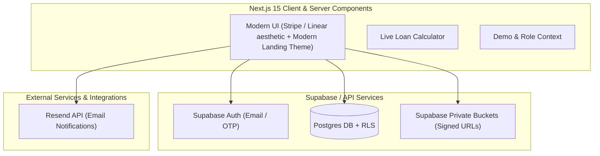

# Implementation Plan - Sahayam (Intra-Organization Lending Platform)

**Sahayam** ("helping" in Telugu) is a complete, production-ready intra-organization workplace community financial assistance documentation and management platform built with Next.js 15 (App Router), React 19, TypeScript, Tailwind CSS, Supabase (Auth, Postgres DB, Storage with RLS), and Resend (Transactional Notifications).

## System Architecture & Data Isolation



### Multi-Tenant Isolation Strategy (Row Level Security)
Every table is scoped to an `org_id`. At the Postgres level:
- Borrower access: `org_id = auth_org_id() AND customer_id = auth.uid()`
- Lender access: `org_id = auth_org_id()`
- Admin access: platform-wide oversight via `auth_is_admin()` helper.
- Cross-organization data leak is strictly impossible at the DB query level.

---

## Key Data Schema (Supabase Postgres)

1. `organizations`: `id`, `name`, `code`, `status`, `capital_pool_limit`, `created_at`
2. `campuses`: `id`, `org_id`, `name`, `code`, `city`, `created_at`
3. `profiles`: `id` (references `auth.users`), `org_id`, `campus_id`, `full_name`, `email`, `role` (`'borrower'` | `'lender'` | `'admin'`), `verification_status` (`'unverified'` | `'pending'` | `'verified'` | `'rejected'`), `rejection_reason`, `id_proof_url`, `employment_proof_url`, `created_at`
4. `loans`: `id`, `org_id`, `customer_id`, `admin_id`, `amount`, `purpose`, `duration_days`, `interest_rate_annual`, `calculated_interest`, `total_repayment`, `due_date`, `status` (`'pending'` | `'approved'` | `'rejected'` | `'active'` | `'completed'`), `disbursal_proof_url`, `repayment_proof_url`, `rejection_reason`, `created_at`, `approved_at`, `active_at`, `completed_at`
5. `agreements`: `id`, `org_id`, `loan_id`, `docuseal_submission_id`, `agreement_number`, `pdf_url`, `borrower_signed`, `lender_signed`, `status`, `created_at`
6. `notifications`: `id`, `org_id`, `user_id`, `title`, `message`, `type`, `read`, `created_at`
7. `audit_logs`: `id`, `org_id`, `actor_id`, `action`, `entity_type`, `entity_id`, `details`, `created_at`

---

## Application Structure

```
sahayam/
├── src/
│   ├── app/
│   │   ├── (auth)/
│   │   │   ├── login/
│   │   │   └── signup/
│   │   ├── borrower/
│   │   │   ├── dashboard/
│   │   │   ├── loans/
│   │   │   ├── request/
│   │   │   ├── profile/
│   │   │   ├── verification/
│   │   │   └── settings/
│   │   ├── lender/
│   │   │   ├── dashboard/
│   │   │   ├── verifications/
│   │   │   ├── loans/
│   │   │   ├── active/
│   │   │   ├── completed/
│   │   │   ├── reports/
│   │   │   └── settings/
│   │   ├── admin/
│   │   │   ├── dashboard/
│   │   │   ├── audit/
│   │   │   ├── organizations/
│   │   │   ├── users/
│   │   │   ├── loans/
│   │   │   └── agreements/
│   │   ├── api/
│   │   │   ├── agreements/
│   │   │   └── cron/
│   │   ├── layout.tsx
│   │   ├── page.tsx
│   │   └── globals.css
│   ├── components/
│   │   ├── ui/ (Button, Card, Input, Modal, Badge, Table, Tabs, Select, Toast)
│   │   ├── layout/ (Sidebar, Topbar, ThemeToggle)
│   │   ├── calculator/ (LiveLoanCalculator)
│   │   ├── agreements/ (AgreementCard, ContractViewer, AgreementTemplateViewer)
│   │   └── reports/ (ReportFilters, ExportCSVButton)
│   ├── lib/
│   │   ├── supabase/ (client, server)
│   │   ├── resend.ts (Resend client & email templates)
│   │   ├── utils.ts (formatting ₹ INR, date math, percentage math)
│   │   └── nav.ts
│   └── context/
│       ├── AuthContext.tsx
│       ├── ThemeContext.tsx
│       └── NotificationContext.tsx
├── supabase/
│   └── migrations/ (0001_extensions_and_enums.sql - 0006_rls_functions_and_policies.sql)
├── package.json
└── README.md
```

---

## Deliverables & Status Checklist

### Core Architecture & RBAC
- ✅ **[COMPLETED] Unified Role Model**: Standardized user roles to `borrower`, `lender`, and `admin`. Deprecated `admin`.
- ✅ **[COMPLETED] Multi-tenant Campuses**: Integrated master database multi-tenancy with campus selection in signup and administrative controls.
- ✅ **[COMPLETED] Admin Dashboard & Operations**: Global management portal at `/admin` for organizations, campuses, user controls, agreement inspection, and security audit logs.
